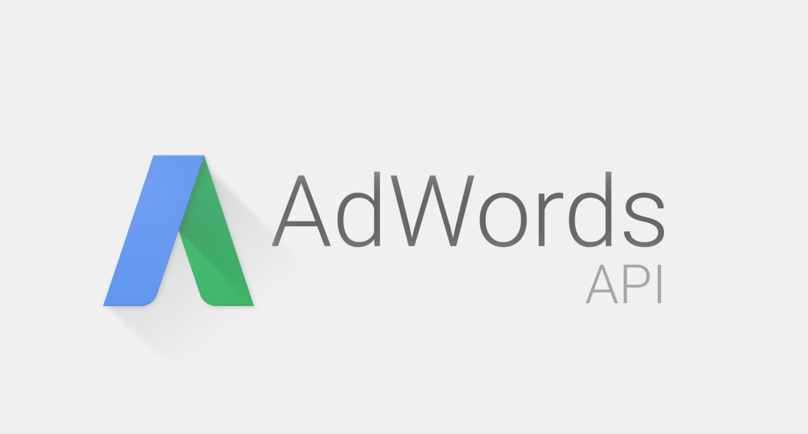
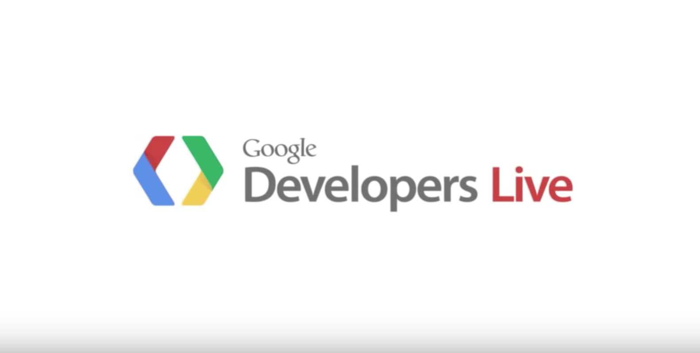
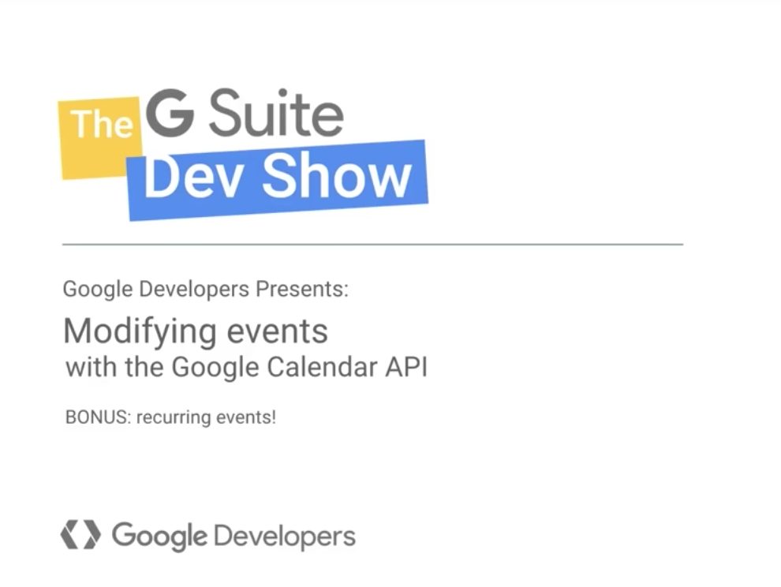

# Introduction to Advanced API

## Learning Competencies
- An Introduction to Advanced API

## Overview

### Intro to concepts
The advanced services in AdWords scripts allow experienced developers to connect to certain public Google APIs with less set-up than using their HTTP interfaces. You use these APIs much like scripts’ built in services, and they offer the same conveniences like auto-completion and automatic authorization.

### Why's and How's??

### Possible uses for Advanced APIs

### Google Analytics
You can use Google Analytics to track the traffic coming to your website and adjust your campaign bids accordingly. If you link a Google Analytics property to your AdWords account, you can also analyze customer activity on your website. This information can shed light on how much of your website traffic or sales comes from AdWords and help you improve your ads and website. You can learn more about linking Analytics and AdWords accounts on our help center.

Watch below video on AdWords:

### Google BigQuery
You can load huge quantities of data into Google Cloud Storage, and then query that data using Google BigQuery. For example, you can load public weather data for the past 10 years and then query for a region's average temperature in a script that uses that information in adjusting bids. Another use would be to do number crunching over your account’s performance data over several years.

Watch below video about Google BigQuery:

### YouTube and YouTube Analytics
You can retrieve and update your videos, playlists, etc. as well as your videos' performance data to make bidding decisions.

Watch below video about Youtube and Youtube Analytics:

### Google Calendar
Your script can create events for future tasks (e.g., run a performance report for your campaigns 2 weeks from today), or perform actions based on an entry you created on your calendar (e.g., enable a campaign on a specific date).

### Shopping Content
Your script can use the Google Content API for Shopping in Apps Script. This API gives Google Merchant Center users the ability to upload and manage their product listings and manage their Merchant Center accounts.

### Google Tasks
Your script can create a reminder list for future tasks (e.g., run a performance report for your campaigns 2 weeks from today), or perform actions based on an entry you created in your reminder list. (e.g., enable a campaign on a specific date).

### Google Prediction
You can use historical data to train the Google prediction engine and perform trend analysis. For example, if you are running a pharmacy and you have historical data on the day’s weather and cold medicine sales, then you can train a model using Google prediction engine and use that to forecast the sales for a given season. Similarly, if you sell thermal jackets, you can use historical weather data and your sales numbers to train a Google prediction engine model. Combine that with the weather forecast for a given day to predict sales for that date, and adjust your bids and budgets accordingly.

## Exploration
- [Google Analytics API](https://developers.google.com/analytics/devguides/reporting/core/v3/quickstart/web-js)
- [Getting Started with Google Big Query API](https://cloud.google.com/bigquery/docs/reference/libraries)
- [Google Calendar API](https://developers.google.com/google-apps/calendar/quickstart/js)
- [Google Tasks API](https://developers.google.com/google-apps/tasks/quickstart/js)
- [Shopping Content API](https://developers.google.com/shopping-content/v2/quickstart)
